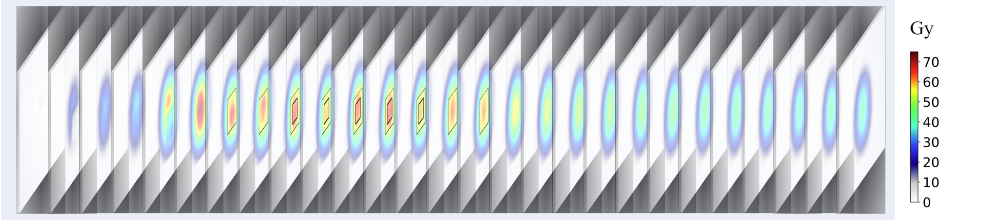
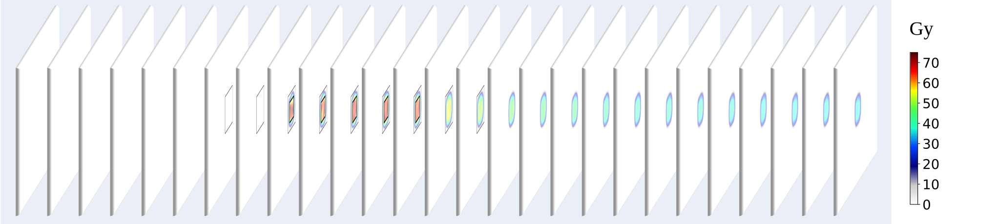
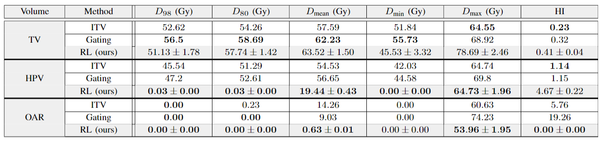

# RL_Delivery

Welcome to the GitHub repository for [*Reinforcement Learning for Real-Time Adaptive Proton Therapy on 4D Synthetic Data*].


<ins>Authors:</ins>

[M. Ghislain](https://scholar.google.com/scholar?hl=fr&as_sdt=0%2C5&authuser=1&q=m%C3%A9lanie+ghislain&oq=m%C3%A9lanie)), [A. Pisvin], [A. Aspeel](https://scholar.google.com/citations?hl=fr&user=EDDQMfgAAAAJ), [D. Dasnoy-Sumell](https://scholar.google.com/citations?hl=fr&user=tzzbfVgAAAAJ), [B. Macq](https://scholar.google.be/citations?user=H9pGN70AAAAJ&hl=fr).


<br>

We introduce a novel, real-time approach to optimize radiation delivery using deep Q-learning using the library Stablebaselines3 [Stablebaselines3](https://stable-baselines3.readthedocs.io/en/master/). 

<p align="center">
  
  <br>
  <em>(a).</em>
</p>
<p align="center">
  
  <br>
  <em>(b).</em>
</p>
<p align="center">
  
  <br>
  <em>(c).</em>
  <em>Figure 2: Accumulated dose on the consecutive slices of the entire environment volume with the TV in bold black and the HPV
delimited by black outline (a) with the ITV technique (b) with the gating technique and (c) with our RL method.</em>
</p>

<p align="center">
  
  <br>
  <em>Figure 2: Mean with standard deviation plot depicting the TV, HPV, and OAR DVHs for our RL approach and for the baseline methods.</em>
</p>


<br><br>
## Contents 📑

- [Setup](#setup-)
- [Datasets](#datasets-️)
- [User Manual](#user-manual-)
- [Citations](#citations-)
- [Contributing](#contributing-)
- [Coming Soon](#coming-soon-)

---
<br><br>
## Setup 🔧

<ins>NB:</ins> the Python version used is 3.9.18.

<br>

Clone GitHub and move to the appropriate directory:

```bash
git clone https://github.com/meghislain/RL_ART_Synthetic
cd RL_ART_Synthetic
```

Create a conda environment and activate it:
```bash
conda env create -f environment.yml
conda activate my_env
```

Or you can create a new environment using pip command:
```bash
# Example using the virtualenv package on linux
python3 -m pip install --user virtualenv
python3 -m virtualenv RL-venv
source RL-venv/bin/activate.csh
```

Install the remaining Python packages requirements:
```bash
pip3 install -r requirements.txt
```

<br>

You are ready to start! 🎉

---
<br><br>
## Datasets 🗂️

---
<br><br>
## User Manual 📘

Running RL_ART_Synthetic consist of 2 major steps:

- [Training, Validating and Testing of the algorithm](#Training,-Validating-and-Testing-of-the-algorithm-️)
- [Additional Testing of the algorithm](#Additional-Testing-of-the-algorithm-️)
- [Visualisation of the results](#visualisation-of-the-results-️)

## 

### Training, Validating and Testing of the algorithm 🖼️📄

To run the algorithm:

```bash
python3 main.py --date
```

All results for each X epochs as well as the final results will be stored as follows:

```
$results/
└── <date>/
  └── <results.pickle>
  └── <results.png>
```

<ins>Notes:</ins>

* Coming soon

## 

### Additional Testing of the algorithm ⚖️📄

To male additional testing episodes of the RL-approach:
```bash
python3 main_test.py
```

<ins>Notes:</ins>

* Coming soon


## 

### Visualisation of the results ⚖️📄

To generate the DVH of the RL-approach and visualise the accumulated dosemap of :
```bash
python3 visualisation.py
```

<ins>Notes:</ins>

* Coming soon


<p align="center">
  
  <br>
  <em>Table 1: Comparative statistical metrics of dosimetric variables of TV, HPV, and OAR.</em>
</p>


---
<br><br>
## Citations 📚


Support our work by citing our paper if you use this repository:
```
Under review process
```


---
<br><br>
## Contributing 🤝

Feel free to contact us by Email:
```
melanie.ghislain@uclouvain.be
```
